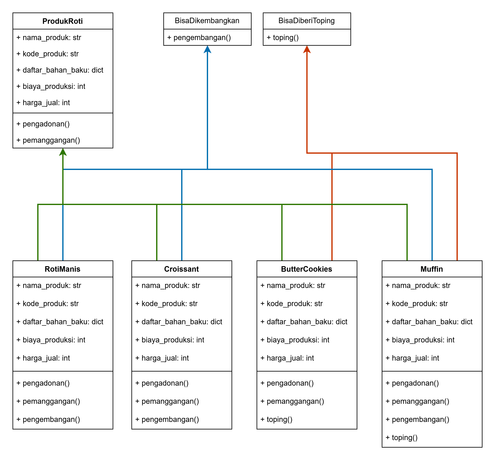
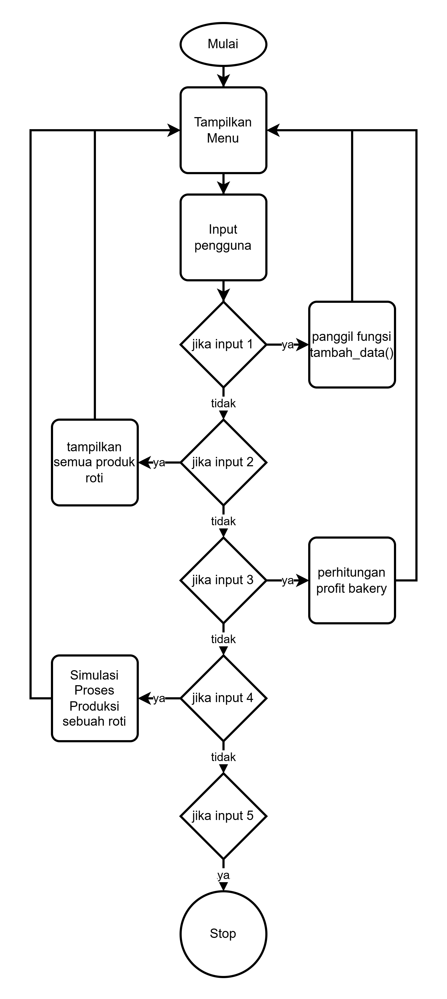

# Sistem Informasi Manajemen Produksi "Hanari Bakery"
## Proyek UAS PBO - Kelompok 6

Repositori ini berisi kode dan dokumentasi untuk proyek Ujian Akhir Semester (UAS) mata kuliah Pemrograman Berorientasi Objek (PBO). Proyek ini mengimplementasikan sistem manajemen untuk sebuah toko roti Hanari Bakery.

---

### Anggota Kelompok

| No | Nama | NIM |
|--|--|--|
|1.|Muhammad Dava Syahputra|K3524058|
|2.|Ryan ivan pratama|K3524034|
|3.|Giga hidro Madani|K3524026|

---

### Deskripsi Proyek

### Fitur Utama

### Diagram Class (UML)

Berikut adalah diagram kelas yang menggambarkan arsitektur dan hubungan antar kelas dalam sistem "Hanari Bakery". Diagram ini dirancang menggunakan [Diagram.io](https://app.diagrams.net) sesuai dengan ketentuan proyek.

### Diagram Flow

Berikut adalam diagaram flow yang menunjukan bagaimana alur program ini berjalan. Dirancang menggunkan [Draw.io](https://app.diagrams.net)

### Teknologi Yang Digunakan
* **Bahasa Pemrogramam:** Python 3
* **Modul Tambahan:** Rich (digunakan untuk tampilan terminal / console yang lebih interaktif)

### Contributor

