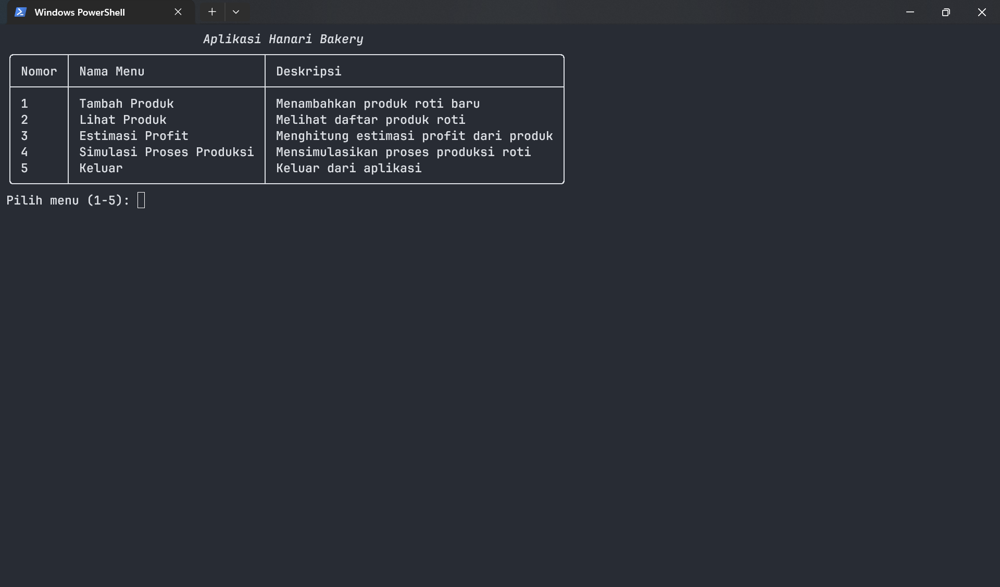
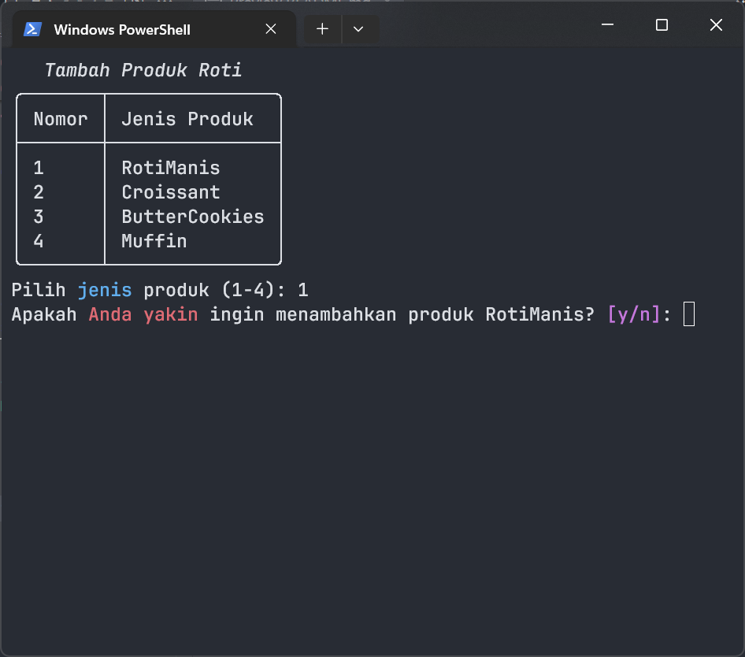
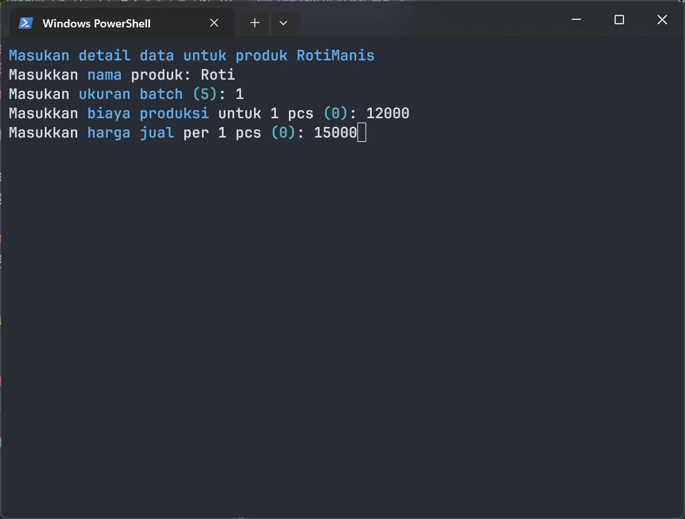
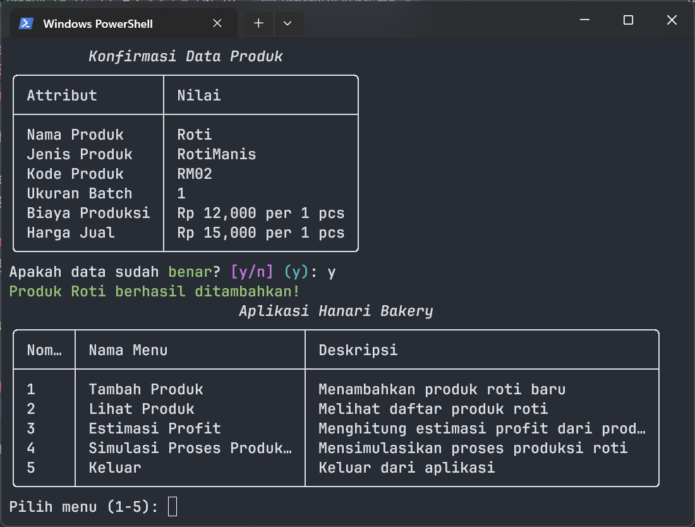
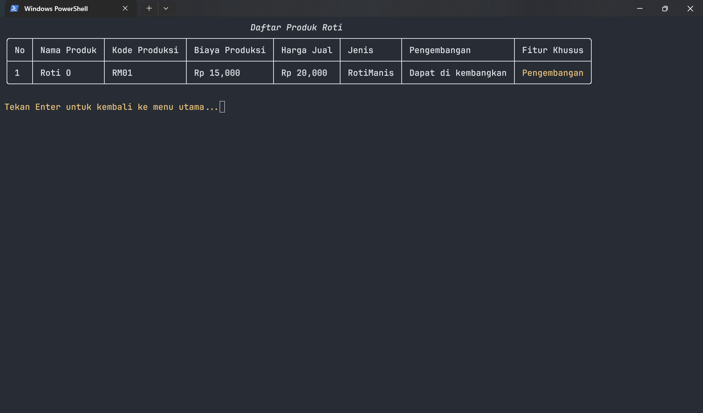
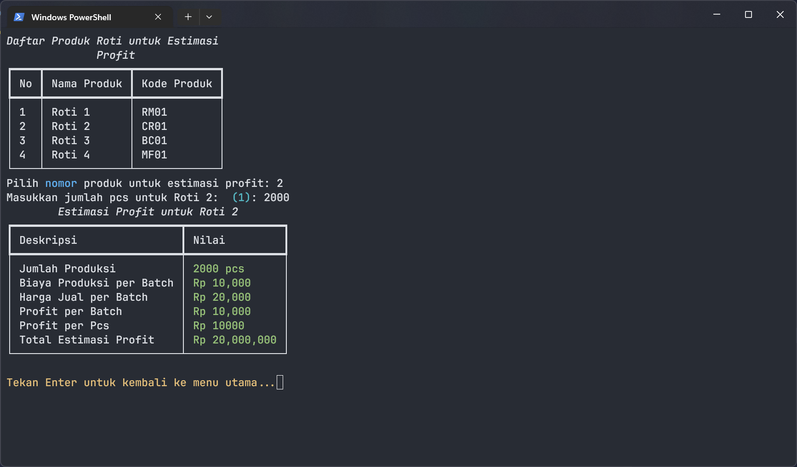
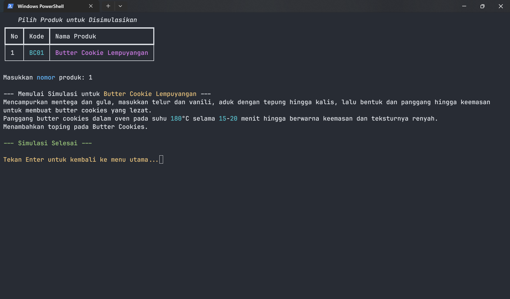

<div align="center">

# Sistem Informasi Manajemen Produksi "Hanari Bakery"
## Proyek UAS PBO - Kelompok 6

</div>

Repositori ini berisi kode dan dokumentasi untuk proyek Ujian Akhir Semester (UAS) mata kuliah Pemrograman Berorientasi Objek (PBO). Proyek ini mengimplementasikan sistem manajemen untuk sebuah toko roti Hanari Bakery.

---

### Anggota Kelompok

| No | Nama | NIM |
|--:|--|--|
|1.|Muhammad Dava Syahputra|K3524058|
|2.|Ryan ivan pratama|K3524034|
|3.|Giga hidro Madani|K3524026|

---

### Deskripsi Proyek

Sistem "Hanari Bakery" adalah aplikasi konsol berbasis Python yang dirancang untuk membantu pemilik toko roti dalam mengelola proses produksi, bahan baku, dan perhitungan estimasi profit. Aplikasi ini menerapkan konsep-konsep inti Pemrograman Berorientasi Objek seperti Abstraksi, Inheritance, dan Interface untuk mengelola berbagai jenis produk roti seperti roti manis, croissant, dan kue kering.

---

### Fitur Utama

Aplikasi ini memiliki beberapa fitur utama yang dimana sesuai dengan kebutuhan tugas.

* **Menambahkan Produk Baru:** Memungkinkan pengguna untuk menambahkan produk baru
* **Menampilkan Semua Produk:** Menampilkan kepada pengguna setiap produk yang tersedia
* **Kalkulator Estimasi Profit:** Membantu pengguna untuk mengkalkulasikan estimasi profit dari sebuah produk
* **Simulasi Proses Produksi:** Menunjukan pengguna bagaimana sebuah produk itu diproduksi

---

### Diagram Class (UML)

Berikut adalah diagram kelas yang menggambarkan arsitektur dan hubungan antar kelas dalam sistem "Hanari Bakery". Diagram ini dirancang menggunakan [Draw.io](https://app.diagrams.net) sesuai dengan ketentuan proyek.


---

### Diagram Flow

Berikut adalam diagaram flow yang menunjukan bagaimana alur program ini berjalan. Dirancang menggunkan [Draw.io](https://app.diagrams.net)


---

### Teknologi Yang Digunakan

* **Bahasa Pemrogramam:** Python 3
* **Modul Tambahan:** Rich (digunakan untuk tampilan terminal / console yang lebih interaktif)

---

### Cara Menjalankan Program

Untuk menjalankan aplikasi ini di komputer , ikuti langkah-langkah berikut:

1.  **Clone repository ini:**
    ```bash
    git clone https://github.com/dachenxi/UAS-B-Kelompok-6.git
    ```

2.  **Masuk ke direktori proyek:**
    ```bash
    cd UAS-B-Kelompok-6
    ```

3. **Instal semua modul yang dibutuhkan dari file `requirements.txt`:**
    ```bash
    pip install -r requirements.txt
    ```

4.  **Jalankan file utama:**
    ```bash
    python main.py
    ```
---

### Uji Coba dan Screenshot

Berikut adalah hasil uji coba program beserta screenshot untuk setiap fitur utama, untuk dokumentasi program.

#### 1. Tampilan Menu Utama

> Tampilan awal saat program dijalankan, menunjukkan semua opsi yang tersedia.

#### 2. Menambah Produk Baru



> Contoh output saat pengguna memilih menu untuk menambahkan produk baru dan memasukkan data yang diperlukan.

#### 3. Menampilkan Semua Produk

> Output yang menampilkan semua produk yang sudah tersimpan dalam sistem.

#### 4. Kalkulator Estimasi Profit

> Hasil perhitungan estimasi profit setelah pengguna memilih jenis roti dan jumlah produksi.

#### 5. Simulasi Proses Produksi

> Contoh simulasi proses pembuatan untuk salah satu jenis roti.


---

### Contributor

[](https://github.com/dachenxi/UAS-B-Kelompok-6/graphs/contributors)